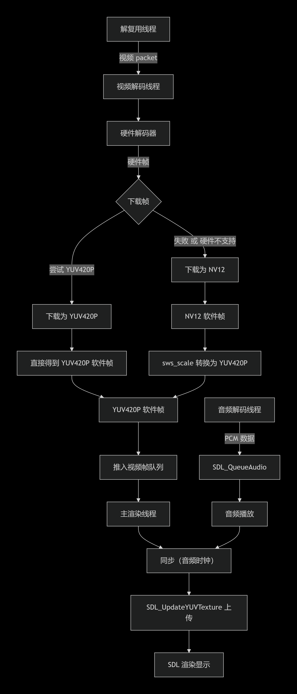
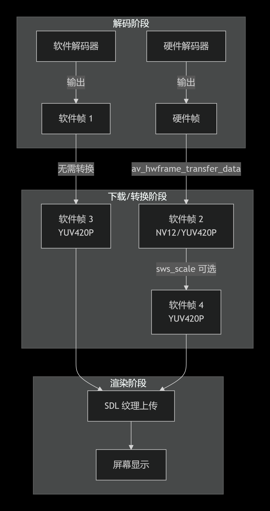

  <a href="README.md">中文</a>

# FFmpeg7-SDL2 Multimedia Practice Project

A multimedia player practice project based on FFmpeg 7.0.2 and SDL2 2.30.6, containing six independent examples including audio playback, PCM playback, video playback, SDL graphics rendering, multi-threaded audio/video synchronized player, and HW hardware-accelerated decoding player. Both software and hardware versions of the audio/video players feature basic playback functionality, media information display, and rotation/scaling adaptation for videos of different resolutions and orientations. For better comparison and understanding, the original hardware-accelerated audio/video player code HW.cpp is preserved, which also supports DXVA2 hardware decoding, but the new version significantly reduces CPU and memory usage, enabling smooth playback of 4K high-frame-rate, extremely high-bitrate videos.

Blog: https://zhuanlan.zhihu.com/p/700478133

## 📦 Dependencies
- **[FFmpeg 7.0.2](https://ffmpeg.org/)** - Core audio/video decoding library
- **[SDL2 2.30.6](https://www.libsdl.org/)** - Cross-platform multimedia rendering library

## 🚀 Quick Start

### Environment Setup
1. Download the required library packages from [Releases](https://github.com/jerryyang1208/FFmpeg7-SDL2_Practice/releases)

2. Extract to the project root directory, ensuring the directory structure is as follows:
<pre>
ffmpeg+SDL2/
├── .vscode/                      # VS Code configuration files
│   ├── c_cpp_properties.json     # C/C++ plugin configuration
│   ├── launch.json               # Debug configuration
│   ├── settings.json             # Editor settings
│   └── tasks.json                # Build task configuration
│
├── FFmpeg-n7.0.2-3-win64-lgpl.../# FFmpeg library folder
├── SDL2-2.30.6/                  # SDL2 library folder
│
├── .gitignore                    # Git ignore configuration
├── README.md                     # Project documentation (Chinese)
├── README_en.md                  # Project documentation (English)
│
├── AudioPlayer.cpp               # Audio player source code
├── PCM_AudioPlayer.cpp           # PCM audio player source code
├── SDL_Pics.cpp                  # SDL graphics rendering source code
├── VideoPlayer.cpp               # Video player source code
├── Audio_Video_Player.cpp        # Multi-threaded audio/video synchronized player source code
├── HW_Audio_Video_Player.cpp     # Hardware-accelerated audio/video player source code
│
├── avcodec-61.dll                # FFmpeg codec library
├── avdevice-61.dll               # FFmpeg device library
├── avfilter-10.dll               # FFmpeg filter library
├── avformat-61.dll               # FFmpeg format library
├── avutil-59.dll                 # FFmpeg utility library
├── swresample-5.dll              # FFmpeg audio resampling library
├── swscale-8.dll                 # FFmpeg image scaling library
└── SDL2.dll                      # SDL2 dynamic link library
</pre>

3. Ensure DLL files are in the same directory as the executable or in the system PATH, as these dynamic link libraries are required at runtime.

### Compilation Environment
- **Compiler**: MSVC (Visual Studio) or MinGW (VS Code)
- **Standard**: C++11/14
- **Include Directories**: Need to add FFmpeg and SDL2 include paths
- **Library Directories**: Need to add FFmpeg and SDL2 lib paths
- **Link Libraries**: 
  - FFmpeg: avformat, avcodec, avutil, swresample, swscale
  - SDL2: SDL2
  - Windows: comdlg32 (for file dialog to select local files after running)

## 📁 Project File Descriptions

### 1. 🎵 AudioPlayer.cpp - Universal Audio Player
**Function**: Supports playback of various audio file formats (such as MP3, FLAC, Opus, WAV, M4A, OGG, AAC, etc.)

**Core Features**:
- Chinese path file selection support
- Automatic audio resampling (unified output to 16-bit stereo)
- Real-time playback progress display
- Audio metadata display (title, artist, album, sample rate, etc.)

**Usage**:
1. Run the program, file selection dialog pops up
2. Select audio file
3. Automatic playback with progress bar display
4. Automatically exits after playback completes

**Technical Highlights**:
- Using FFmpeg to decode various audio formats
- Using Swresample for audio format conversion
- Using SDL queue mode for audio playback

---

### 2. 🎛️ PCM_AudioPlayer.cpp - PCM Raw Audio Player
**Function**: Play raw PCM audio files (44.1kHz, 16-bit, stereo)

**Core Features**:
- Directly read PCM file into memory
- Use SDL queue for audio data
- Simple file selection interface

**Usage**:
1. Run the program, select a .pcm file
2. Program automatically plays (Note: PCM file must be 44.1kHz / 16-bit / stereo format)
3. Automatically exits after playback completes

**Important Notes**:
- ⚠️ Only supports fixed parameters: 44.1kHz sample rate, 16-bit depth, stereo
- If PCM file parameters don't match, playback speed will be abnormal or noise will occur

---

### 3. 🖼️ SDL_Pics.cpp - SDL2 Graphics Drawing Example
**Function**: Demonstrates basic drawing functions of SDL2

**Core Features**:
- Create borderless window
- Draw filled rectangles (large blue rectangle, small cyan rectangle)
- Draw white triangle outline
- Red background

**Usage**:
1. Run the program, SDL graphics window displays
2. Window automatically closes after 5 seconds

**Display Effects**:
- Background: Red
- Large blue rectangle: Position (50,50), size 300x200
- White triangle: Closed outline formed by four points
- Small cyan rectangle: Position (400,300), size 100x100

---

### 4. 🎬 VideoPlayer.cpp - Video Player
**Function**: Play various video file formats (MP4, MKV, AVI, FLV, MOV, etc.)

**Core Features**:
- Chinese path file selection support
- Automatic audio/video synchronization
- Adjustable window size (画面自动拉伸)
- YUV420P format rendering (ensuring compatibility)

**Usage**:
1. Run the program, select video file
2. Video automatically plays
3. Close window or automatically exit after playback completes

**Technical Highlights**:
- Using FFmpeg to decode video frames
- Using Swscale to convert various pixel formats to YUV420P
- Using SDL texture for video rendering
- PTS (Presentation Time Stamp) based audio/video synchronization

---

### 5. 🎯 Audio_Video_Player.cpp - Multi-threaded Audio/Video Synchronized Player (New ⭐)
**Function**: Professional-grade audio/video player based on **multi-threaded decoding + queue buffering + audio-based synchronization**, supporting audio/video file playback, with no window for pure audio files.

**Core Features**:
- ✅ **Multi-threaded Architecture**: Independent demuxing thread, audio decoding thread, video decoding thread, efficient CPU utilization
- ✅ **Thread-safe Queue**: Lock-free data transfer using custom `SafeQueue` template
- ✅ **Smart Stream Recognition**: Automatically excludes cover picture streams (like MP3 album art), no video window for pure audio playback
- ✅ **Precise Synchronization**: Audio clock-based, dynamically adjusts video rendering timing (supports early waiting, late dropping)
- ✅ **Real-time Progress Display**: Shows current playback progress in console (minutes:seconds format)
- ✅ **Graceful Exit**: Supports window close exit, automatically waits for audio playback to complete before ending
- ✅ **Queue Mode Audio Output**: No callback, directly pushes data with `SDL_QueueAudio`, simple and reliable

**Data Flow Architecture**: 
File → [Demux Thread] → Audio Packet Queue → [Audio Decode Thread] → SDL_QueueAudio → Audio Device
                  → Video Packet Queue → [Video Decode Thread] → Video Frame Queue → [Main Thread Render] → Window

**Technical Highlights**:
- Using FFmpeg 7.0 API (`avcodec_send_packet` / `avcodec_receive_frame`)
- Audio resampling to S16 stereo, video uniformly converted to YUV420P
- Audio clock calculation: `total pushed samples - samples remaining in SDL internal queue` / sample rate
- Sync thresholds: video ahead >100ms wait, behind >300ms drop
- Perfect support for audio files with covers (like MP3, FLAC), no black window
- Introduced filter library, supports rotation and scaling adaptation for videos of different resolutions and orientations

**Usage**:
1. Run the program, select media file (audio or video)
2. If pure audio file, no window pops up, console displays playback progress
3. If video file, window pops up and playback starts,画面与声音同步
4. Automatically exits after playback completes, or click window close button to exit

---

### 6. ⚡ HW.cpp - Hardware-Accelerated Multi-threaded Audio/Video Synchronized Player
**Function**: Based on **Audio_Video_Player.cpp**, adds **DXVA2 hardware decoding support**, significantly reducing CPU usage, especially suitable for smooth playback of 4K/8K high-bitrate videos. Automatically falls back to software decoding when hardware acceleration is unavailable.

**Core Features**:
- ✅ **DXVA2 Hardware Acceleration**: Automatically detects and enables DXVA2, offloading decoding tasks to GPU, drastically reducing CPU load
- ✅ **Multi-threaded Architecture**: Inherits the efficient multi-threaded design (independent demux, audio decode, video decode threads)
- ✅ **Bounded Queues with Backpressure**: All queues have maximum capacities (audio packets 100, video packets 50, video frames 10), preventing memory explosion
- ✅ **Intelligent Memory Management**: Fixed memory leaks in original version (including unreleased AVPacket and AVFrame), memory stable for long-term operation
- ✅ **Automatic Fallback**: If hardware acceleration initialization fails (e.g., graphics card doesn't support DXVA2), automatically switches to software decoding, ensuring usability
- ✅ **Precise Audio/Video Synchronization**: Maintains audio clock-based sync strategy, supports early waiting, late dropping
- ✅ **Pure Audio Support**: Also suitable for pure audio files, no window pops up

**Data Flow Architecture** (same as software version):
File → [Demux Thread] → Audio Packet Queue → [Audio Decode Thread] → SDL_QueueAudio → Audio Device
                  → Video Packet Queue → [Video Decode Thread (Hardware Accelerated)] → Video Frame Queue → [Main Thread Render] → Window

**Technical Highlights**:
- **Hardware Acceleration Initialization**: Iterates through decoder's `AVCodecHWConfig`, selects DXVA2 device type, creates hardware device context and associates with decoder
- **Hardware Frame Download**: Uses `av_hwframe_transfer_data()` to download frames from GPU to system memory,优先下载为 YUV420P, if fails attempts NV12 and converts
- **Persistent Download Frames**: Pre-allocates two download frames (YUV420P and NV12) to reduce frequent allocation, reused in video decoding thread
- **Memory Optimization**: Bounded queues with backpressure mechanism, producers automatically block when queue is full, avoiding infinite accumulation; all `AVPacket` and `AVFrame` are correctly freed
- **Compatibility**: Output still YUV420P, consistent with SDL texture format, no need to modify rendering code

**Performance Comparison** (tested with 4K 60fps 70Mbps high-stress video):
- Software decoding version: CPU usage ≈ 30%, memory ≈ 650MB
- Hardware acceleration version: CPU usage ≈ 7%, memory ≈ 700MB (增加约 50MB for download frames, but换来 4x CPU performance improvement)

**Usage**:
1. Run the program, select media file (audio or video)
2. Program automatically detects hardware acceleration capability, if supported enables DXVA2, console outputs `Hardware acceleration (DXVA2) enabled.`
3. If hardware acceleration unavailable, automatically uses software decoding, outputs提示 and continues decoding playback
4. Playback experience identical to software version during playback, but CPU usage significantly reduced, capable of handling higher-load video playback tasks

**Different Version**: The earliest version **HW_Audio_Video_Player.cpp** based on **HW.cpp** newly introduced filter library support for rotation and scaling adaptation of videos with different resolutions and orientations, additionally reduced thread count to improve single-thread efficiency, and optimized大量内存管理与回退机制, memory usage for the same high-stress video is only half of the original!

---

## ⚙️ VS Code Configuration Description

Project includes `.vscode` configuration folder:
- `c_cpp_properties.json` - C/C++ plugin configuration (includes library paths)
- `launch.json` - Debug configuration
- `settings.json` - Editor settings
- `tasks.json` - Build task configuration

## 🔧 Frequently Asked Questions

### Q1: Cannot find FFmpeg/SDL2 header files during compilation
**A**: Check if include paths in `.vscode/c_cpp_properties.json` are correct

### Q2: Missing DLL errors at runtime
**A**: Ensure all DLL files are in the same directory as the executable, or added to system PATH

### Q3: PCM playback speed wrong or noise
**A**: PCM_AudioPlayer.cpp only supports 44.1kHz / 16-bit / stereo format, please check PCM file parameters

### Q4: Audio file won't play
**A**: AudioPlayer.cpp supports mainstream formats, but某些特殊编码的文件可能需要额外的解码器

### Q5: Multi-threaded player high CPU usage at runtime?
**A**: Normal phenomenon, multi-threaded decoding充分利用 CPU. Main loop已添加 `SDL_Delay(10)` to avoid spinning, if still too high can适当增大延时

### Q6: Hardware acceleration version uses more memory than software version?
**A**: Hardware acceleration version pre-allocates两个下载帧 (approx 20MB) for获取数据 from GPU, this is正常现象. Compared to software version, hardware acceleration version CPU usage can降低 70%+, for高分辨率视频 this is值得的.

### Q7: What if hardware acceleration enable fails?
**A**: Program automatically falls back to software decoding,不影响播放. Can check if graphics card supports DXVA2, or update graphics driver.

## 📝 Changelog

### v1.0.0 (2026.2.28)
- Implemented four independent functional modules
- Chinese path file selection support
- Added detailed metadata display

### v1.1.0 (2026.3.3)
- **New**: `Audio_Video_Player.cpp` multi-threaded audio/video synchronized player
- **Optimization**: Improved stream recognition logic, pure audio files不再弹出视频窗口
- **Documentation**: Updated README, detailed multi-threaded player architecture

### v1.2.0 (2026.3.6)
- **New**: `HW_Audio_Video_Player.cpp` hardware-accelerated multi-threaded audio/video synchronized player (DXVA2 support)
- **Optimization**: Software/hardware version code, all queues采用有界设计,引入背压机制,彻底解决内存暴涨问题
- **Fix**: Memory leaks in demux and decode threads (unreleased AVPacket and AVFrame)
- **Performance**: Hardware acceleration version playing 4K高码率视频 CPU usage降低约 70%
- **Documentation**: Added detailed hardware acceleration version description and performance comparison data

### v1.3.0 (2026.3.8)
- **New**: `Audio_Video_Player.cpp` `HW_Audio_Video_Player.cpp` both introduce FFmpeg filter library, retaining the original hardware-accelerated player code without filter library as HW.cpp for future differentiated learning and performance comparison.
- **Optimization**: Software/hardware version player code, both通过滤镜增添了对手机竖屏视频的自动旋转伸缩适配
- **Performance**: `HW_Audio_Video_Player.cpp` playing 4K高码率视频 memory usage从 800MB 降低到 350MB
- **Documentation**: Added Zhihu blog https://zhuanlan.zhihu.com/p/2013200050549958415 详细介绍硬件加速的原理、流程以及代码应用,还有滤镜库引用后的视频画面的旋转伸缩适配

## 📄 License

This project is for learning and communication purposes only. FFmpeg and SDL2 follow their respective open source licenses.

## 👤 Author

- GitHub: [@jerryyang1208](https://github.com/jerryyang1208)

## ⭐ Acknowledgements

- [FFmpeg](https://ffmpeg.org/) community
- [SDL](https://www.libsdl.org/) development team